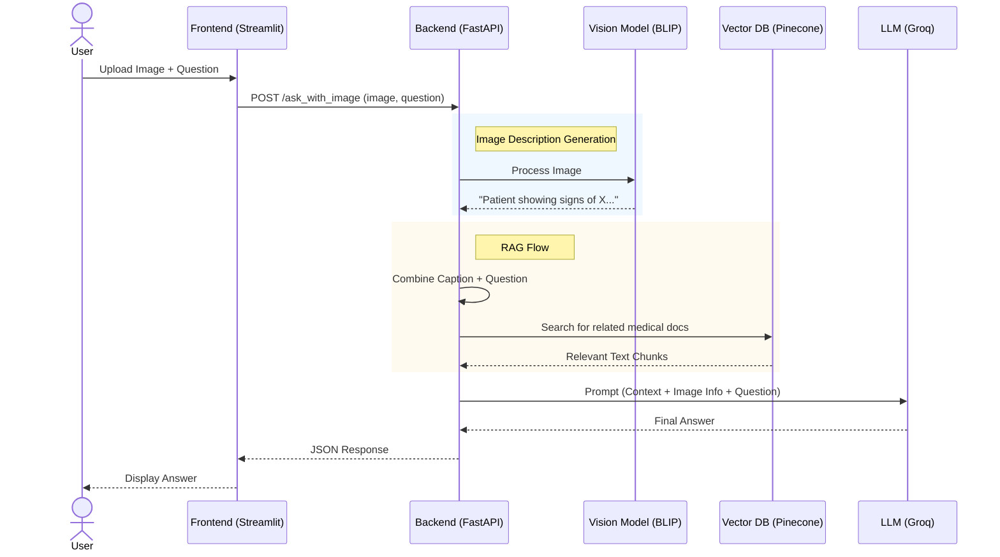

# Sequence Diagram: Ask with Image

```mermaid
sequenceDiagram
    actor User
    participant FE as Frontend (Streamlit)
    participant BE as Backend (FastAPI)
    participant BLIP as Vision Model (BLIP)
    participant DB as Vector DB (Pinecone)
    participant LLM as LLM (Groq)

    User->>FE: Upload Image + Question
    FE->>BE: POST /ask_with_image (image, question)
    
    rect rgb(240, 248, 255)
        note right of BE: Image Description Generation
        BE->>BLIP: Process Image
        BLIP-->>BE: "Patient showing signs of X..."
    end
    
    rect rgb(255, 250, 240)
        note right of BE: RAG Flow
        BE->>BE: Combine Caption + Question
        BE->>DB: Search for related medical docs
        DB-->>BE: Relevant Text Chunks
    end
    
    BE->>LLM: Prompt (Context + Image Info + Question)
    LLM-->>BE: Final Answer
    BE-->>FE: JSON Response
    FE-->>User: Display Answer
```
